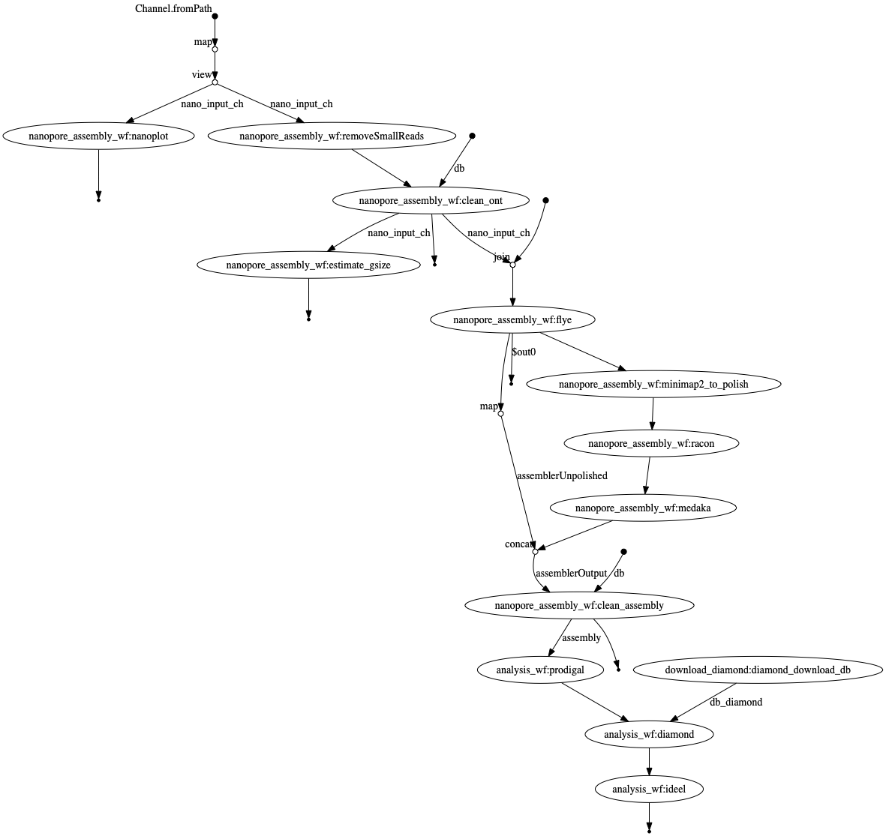
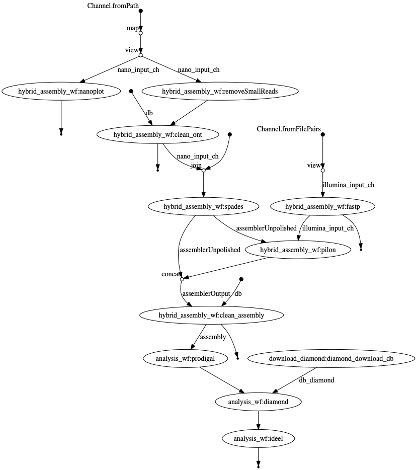
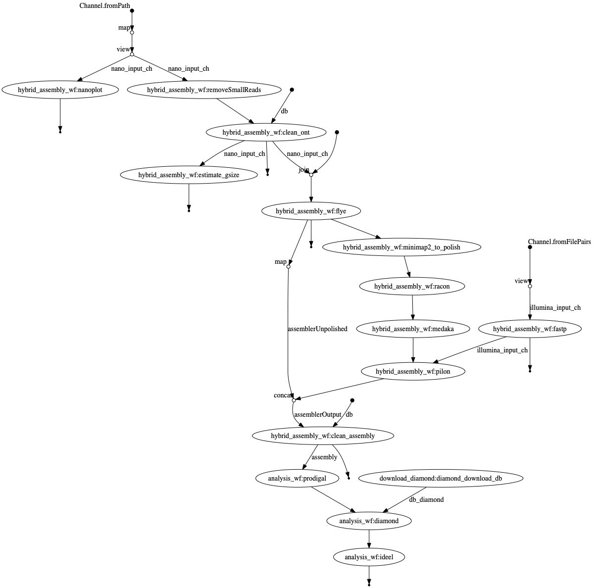
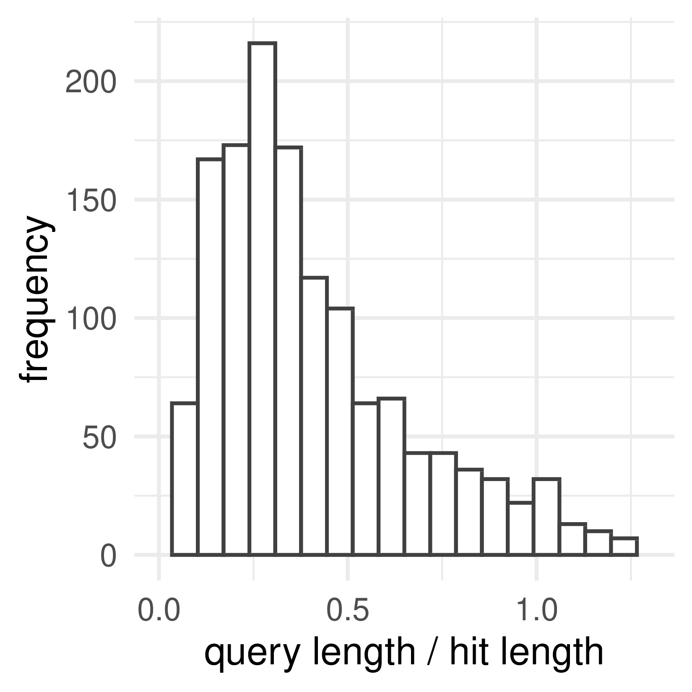
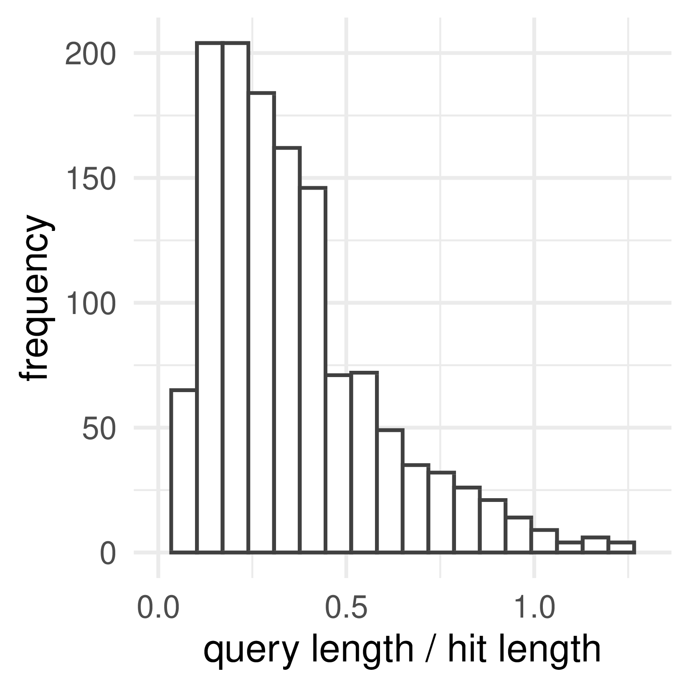
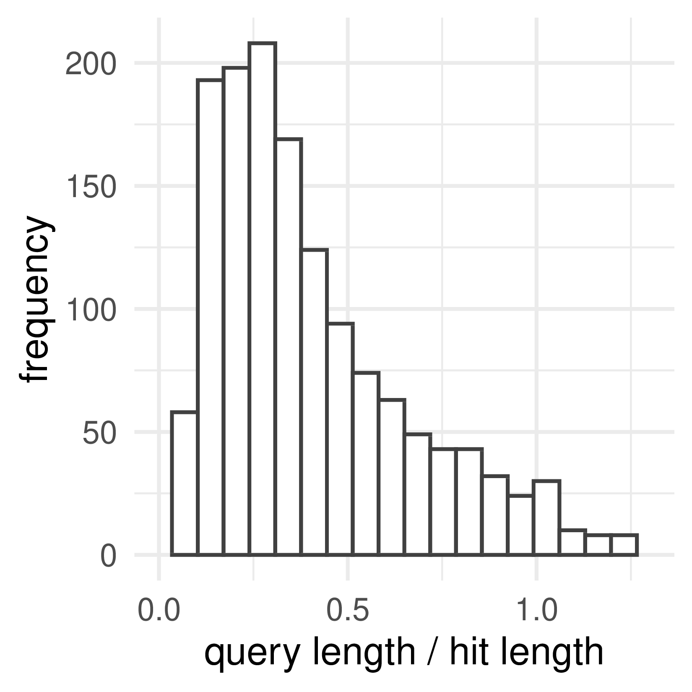
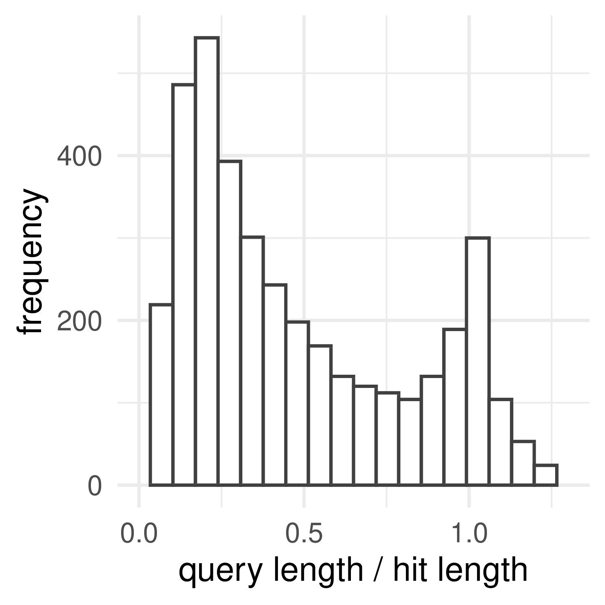
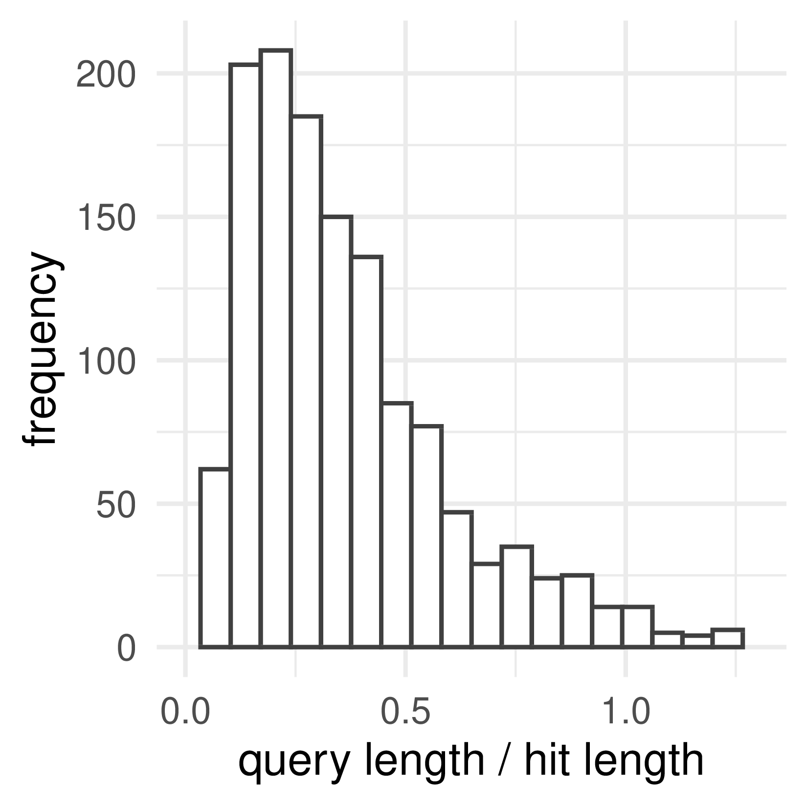
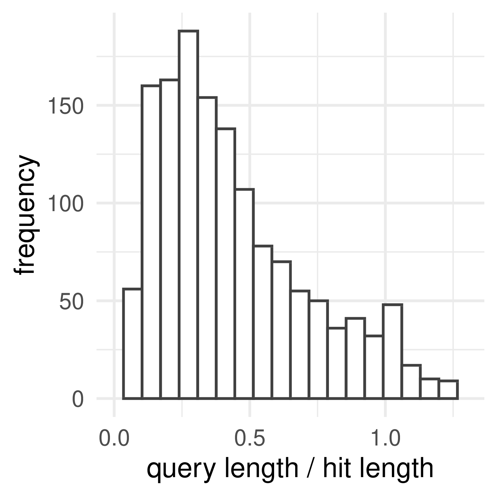
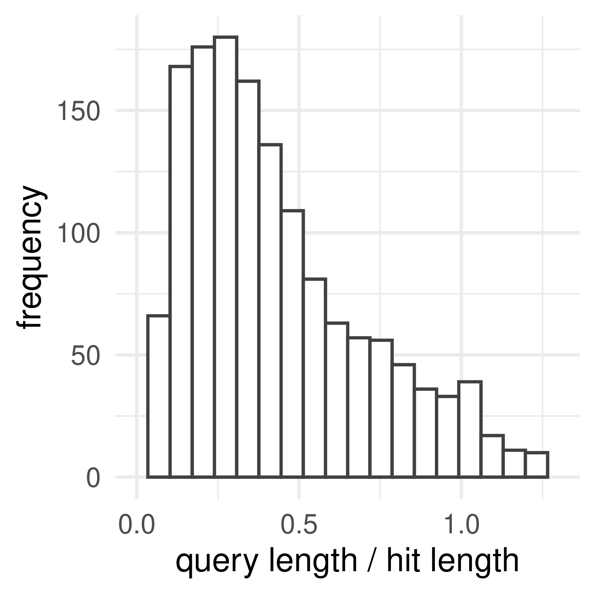

# MGnify-LR Workflow


Maintainer: Martin H&ouml;lzer

Email: hoelzer.martin@gmail.com

# Workflow

## Nanopore-only w/ decontamination


## Hybrid w/ metaSPAdes and decontamination


## Hybrid w/ flye and decontamination


# Input examples

* **one** .fastq file per sample: `--nano 'sample1.fastq'`
* paired end illumina: `--illumina 'S_41_17_Cf*.R{1,2}.fastq.gz'`

Hybrid data needs to have matching simpleNames such as ``sample1.fastq.gz`` (ONT) and ``sample1.R{1,2}.fastq.gz`` (Illumina).

# Execution example

After pulling this git:
```
nextflow run main.nf --nano test_data/ERR3662306_1_small.fastq.gz -profile local,docker
```

or let nextflow pull this git:

```
nextflow run hoelzer/mgnify-lr --nano ~/.nextflow/assets/hoelzer/mgnify-lr/test_data/ERR3662306_1_small.fastq.gz --output ~/mgnify-lr_output -profile local,docker
```

to also decontaminate your reads and final assembly just add a ``--species`` like this:

```
nextflow run hoelzer/mgnify-lr --nano ~/.nextflow/assets/hoelzer/mgnify-lr/test_data/ERR3662306_1_small.fastq.gz --output ~/mgnify-lr_output --species eco -profile local,docker
```

Currently supported species are:
* hsa [Ensembl: Homo_sapiens.GRCh38.dna.primary_assembly]
* mmu [Ensembl: Mus_musculus.GRCm38.dna.primary_assembly]
* eco [Ensembl: Escherichia_coli_k_12.ASM80076v1.dna.toplevel]


# Profiles
This workflow comes with some pre-defined profiles for local execution and execution on a HPC using Conda, Docker, and Singularity. You can combine different profiles to run the pipeline on different systems (local, LSF, SLURM, Cloud) using different technologies (Conda, Docker, Singularity). 

For the most _basic_ execution on a local machine using Docker use: 
```
-profile local,docker
```

If you want to use Conda instead of Docker:
```
-profile local,conda
```

If you want to run on a HPC w/ LSF and Singularity use:
```
-profile lsf,docker,singularity
# In that case you should also adjust --cachedir, --workdir, --databases to match your HPC environment
```

# Execution examples of possible input and decontamination combinations

Below are execution examples for the test data in this repository. For each command ideel plots show the difference between the raw and polished assembly. Please keep in mind that this is only a small toy sample.

## Nanopore-only 
```bash
nextflow run main.nf --list --nano test_data/ont.csv --workdir work -profile local,docker --output results/test_ont-only
```
<p>
    
    
</p>


## Nanopore-only w/ decontamination of ONT spike-in control
```bash
nextflow run main.nf --list --nano test_data/ont.csv --workdir work -profile local,docker -resume --output results/test_ont-only-clean --index_ont clean/ont/DCS.mmi --index_fna clean/assembly/DCS_FNA.mmi
```
<p>
    
    
</p>

## Hybrid using SPAdes 
```bash
nextflow run main.nf --list --nano test_data/ont.csv --illumina test_data/ill.csv --workdir work -profile local,docker -resume --output results/test_hybrid-spades 
```
<p>
    
    
</p>

## Hybrid using SPAdes w/ decontamination of ONT and Illumina spike-in controls
```bash
nextflow run main.nf --list --nano test_data/ont.csv --illumina test_data/ill.csv --workdir work -profile local,docker -resume --output results/test_hybrid-spades-clean --index_ont clean/ont/DCS.mmi --index_fna clean/assembly/NC_001422_DCS.mmi --bbduk clean/NC_001422.fna.gz 
```
<p>
    
    
</p>

## Hybrid using Flye 
```bash
nextflow run main.nf --list --nano test_data/ont.csv --illumina test_data/ill.csv --workdir work -profile local,docker -resume --output results/test_hybrid-flye --assemblerHybrid flye
```
<p>
    
    
</p>


## Hybrid using Flye w/ decontamination of ONT and Illumina spike-in controls
```bash
nextflow run main.nf --list --nano test_data/ont.csv --illumina test_data/ill.csv --workdir work -profile local,docker -resume --output results/test_hybrid-flye-clean --index_ont clean/ont/DCS.mmi --index_fna clean/assembly/NC_001422_DCS.mmi --bbduk clean/NC_001422.fna.gz --assemblerHybrid flye
```
<p>
    
    
</p>
