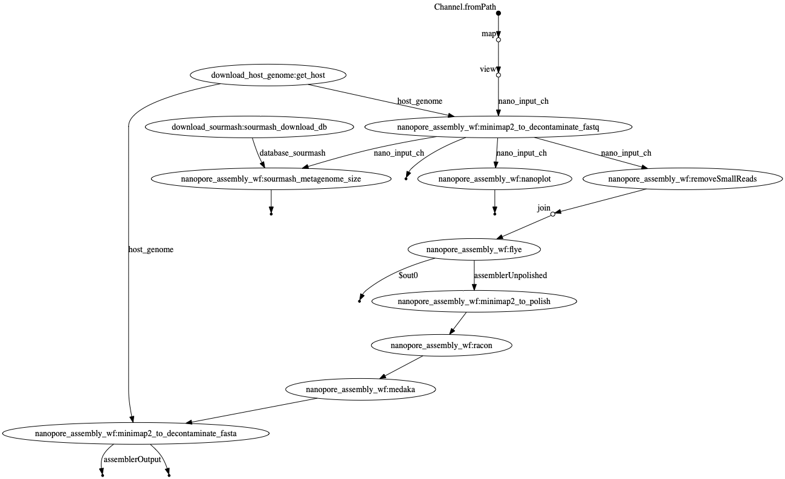

# Workflow Metagenomics


Maintainer: Martin Hoelzer

Email: hoelzer.martin@gmail.com

# Workflow



# Input examples

* **one** .fastq file per sample: `--nano 'sample1.fastq'`
* paired end illumina: `--illumina 'S_41_17_Cf*.R{1,2}.fastq.gz'`

# Execution example

```
nextflow run main.nf --nano '*/*.fastq'
```