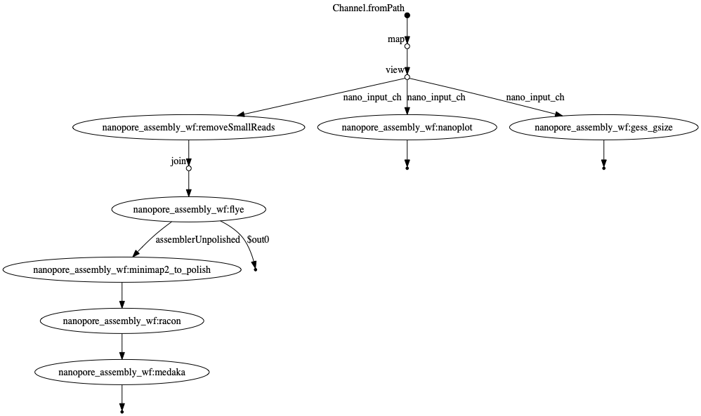
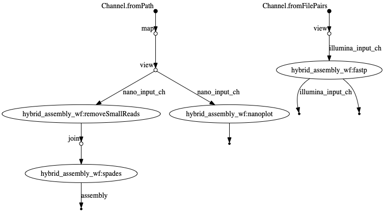

# MGnify-LR Workflow


Maintainer: Martin H&ouml;lzer

Email: hoelzer.martin@gmail.com

# Workflow

## Nanopore-only


## Hybrid


## Nanopore-only with decontamination


# Input examples

* **one** .fastq file per sample: `--nano 'sample1.fastq'`
* paired end illumina: `--illumina 'S_41_17_Cf*.R{1,2}.fastq.gz'`

Hybrid data needs to have matching simpleNames such as ``sample1.fastq.gz`` (ONT) and ``sample1.R{1,2}.fastq.gz`` (Illumina).

# Execution example

After pulling this git:
```
nextflow run main.nf --nano test_data/ERR3662306_1_small.fastq.gz
```

or let nextflow pull this git:

```
nextflow run hoelzer/mgnify-lr --nano ~/.nextflow/assets/hoelzer/mgnify-lr/test_data/ERR3662306_1_small.fastq.gz --output ~/mgnify-lr_output
```

to also decontaminate your reads and final assembly just add a ``--species`` like this:

```
nextflow run hoelzer/mgnify-lr --nano ~/.nextflow/assets/hoelzer/mgnify-lr/test_data/ERR3662306_1_small.fastq.gz --output ~/mgnify-lr_output --species eco
```

Currently supported species are:
* hsa [Ensembl: Homo_sapiens.GRCh38.dna.primary_assembly]
* mmu [Ensembl: Mus_musculus.GRCm38.dna.primary_assembly]
* eco [Ensembl: Escherichia_coli_k_12.ASM80076v1.dna.toplevel]

# ToDo

* decontamination of short reads

